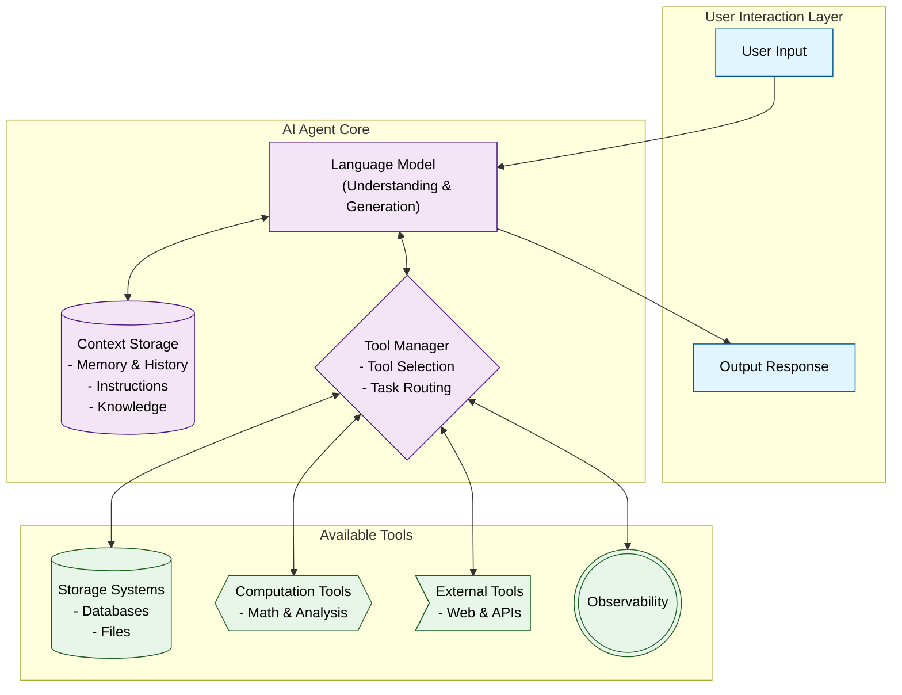

# Hello World AI Agent

Build your first AI agent using Python! This project demonstrates how to create a simple conversational AI agent using modern tools and frameworks.

## Overview

This project uses:
- [Agno](https://Agno.com) - A powerful framework for building AI agents
- [ollama](https://ollama.com) - Local LLM provider for AI capabilities

## Prerequisites

Before you begin, ensure you have the following installed:
- [git](https://git-scm.com/)
- [Python 3.10+](https://www.python.org/downloads/)
- [uv](https://astral.sh/uv) - Modern Python package installer and environment manager
- [ollama](https://ollama.com/download) - Local LLM provider
- Your favorite text editor (Vim, VSCode, Notepad++, Windsurf, Cursor, etc)

Then run:   
```bash
git clone https://github.com/tobalo/ai-agent-hello-world.git
cd ai-agent-hello-world # navigate into the cloned repository
```

## Installation

### Quick Setup
1. Download and install Ollama from [ollama.com/download](https://ollama.com/download)
2. Install uv:
```bash
# macOS/Linux
curl -LsSf https://astral.sh/uv/install.sh | sh

# Windows (PowerShell)
powershell -ExecutionPolicy ByPass -c "irm https://astral.sh/uv/install.ps1 | iex"
```

### Project Setup

1. Create a virtual environment:
```bash
uv venv
```

2. Activate the virtual environment:
```bash
# macOS/Linux
source .venv/bin/activate

# Windows
.venv\Scripts\activate
```

3. Install dependencies:
```bash
uv pip install agno ollama
```

4. Start Ollama:
```bash
ollama run llama3.2:1b
```

5. Launch the agent:
```bash
python3 agent.py
```

6. Launch the web search agent:
```bash
python3 websearch-agent.py
```

## Next Steps

Now that your AI agent is running, you can:
- Customize its behavior and responses
- Add new capabilities using [Agno's toolkits](https://docs.Agno.com/tools/toolkits)
- Experiment with different LLM models available through Ollama

## Resources

- [Agno Documentation](https://docs.Agno.com)
- [Ollama Blog](https://ollama.com/blog)
- [Project Issues](https://github.com/yourusername/ai-agent-hello-world/issues)

